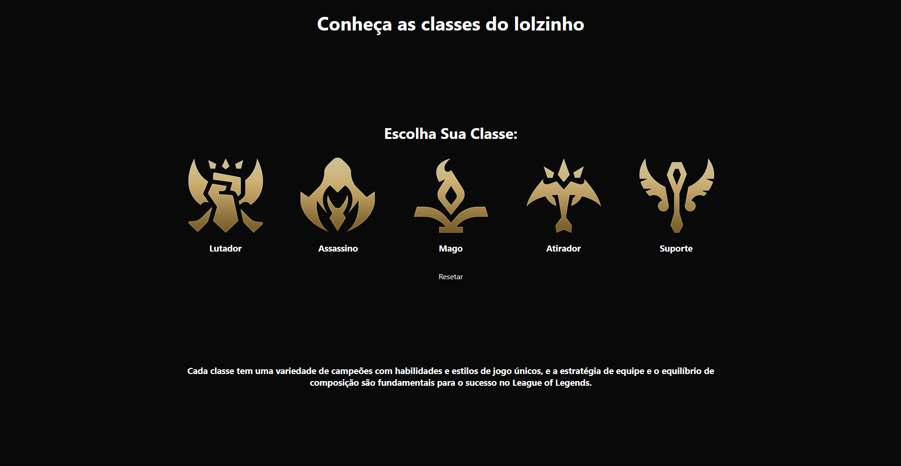

# vs12-front-styled-components-task-01

<p align="center">
Tarefa avaliativa do Programa Vem Ser, 12ª Edição.<br/> Desenvolvedor: Luiz Felipe
</p>

<p align="center">
    <a href="#-tecnologias">Tecnologias</a>&nbsp;&nbsp;&nbsp;|&nbsp;&nbsp;&nbsp;
    <a href="#-sobre-o-projeto">Sobre o Projeto</a>&nbsp;&nbsp;&nbsp;
</p>

<p align="center">
  
</p>

<a align="center" href="https://vs12-front-03-react-projeto-final.vercel.app/">Acesse o deploy no Vercel.</a>
## 🚀 Tecnologias

Esse projeto foi desenvolvido com as seguintes tecnologias:

- Typescript
- React
- Styled Components

## 🛠️ Instalação do projeto

Instalação das dependências:
```
npm i
```

Comando para vizualizar a cobertura de testes da aplicação:
```
npm run test-coverage src
```


## 💻 Sobre o Projeto

A eLendo é uma plataforma de cadastro e busca de acervos de bibliotecas em todo o Brasil. Através dela, um leitor pode pesquisar gratuitamente sobre a disponibilidade de qualquer livro dentro das instituições participantes.

<a href="https://www.figma.com/file/1eOhSovlAwGRDPxVIEHyNr/eLendo-2.0?type=design&node-id=0%3A1&mode=design&t=0TSPSDEuzpW5CadO-1">Veja aqui</a> o projeto no Figma.

## ⚙️ Para navegar:

